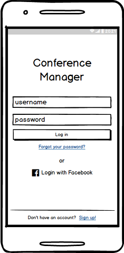
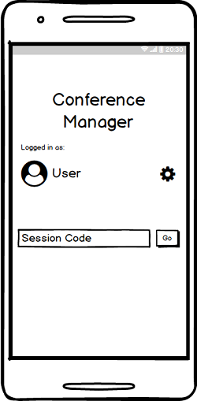
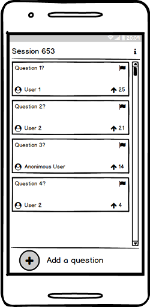

# openCX-*your module name* Development Report

Welcome to the documentation pages of the *your (sub)product name* of **openCX**!

You can find here detailed about the (sub)product, hereby mentioned as module, from a high-level vision to low-level implementation decisions, a kind of Software Development Report, organized by discipline (as of RUP): 

* Business modeling 
  * [Product Vision](#Product-Vision)
  * [Elevator Pitch](#Elevator-Pitch)
* Requirements
  * [Use Case Diagram](#Use-case-diagram)
  * [User stories](#User-stories)
  * [Domain model](#Domain-model)
* Architecture and Design
  * [Logical architecture](#Logical-architecture)
  * [Physical architecture](#Physical-architecture)
  * [Prototype](#Prototype)
* [Implementation](#Implementation)
* [Test](#Test)
* [Configuration and change management](#Configuration-and-change-management)
* [Project management](#Project-management)

So far, contributions are exclusively made by the initial team, but we hope to open them to the community, in all areas and topics: requirements, technologies, development, experimentation, testing, etc.

Please contact us! 

Thank you!

André Filipe da Silva Moutinho
João Ricardo Ribeiro Cardoso
Nuno Duarte Ferreira Neves Mourinha Gonçalves
Sergio Bruno Rodrigues Dias

---

## Product Vision

Our vision is simple: we want to revolutionise the way conferences are carried out. Ultimately, we are aiming towards a new "conference style", in which participants have a bigger role than ever. In our view, conferences should no longer be about big talks and just hearing.

---
## Elevator Pitch

(todo: translate)Para dar resposta à necessidade de envolver os participantes das conferências, quer entre si mesmos, quer com os palestrantes, pretende-se criar a app "Conference Manager". Esta pretende aumentar a facilidade por parte dos participantes em colocar perguntas ao palestrante através de uma app. Caso vários participantes tenham a mesma questão, podem simplesmente dar "like" numa que já exista, aumentando a sua prioridade. As perguntas serão mostradas num ecrã orientado ao palestrante, através de um raspberry pi. Esta solução permite que as perguntas sejam respondidas em tempo pertinente,evitando mudanças de contexto que prejudiquem o rumo da conferência.

---
## Requirements

Our module is an interation between speaker, listeners and 

In this section, you should describe all kinds of requirements for your module: functional and non-functional requirements.

Start by contextualizing your module, describing the main concepts, terms, roles, scope and boundaries of the application domain addressed by the project.

### Use case diagram

### User stories

Our user stories can be seen in [this link](https://trello.com/b/lqFjtiSm/user-stories)

Some mockups that aim to represent our solution to the user stories:

### Domain model

To better understand the context of the software system, it is very useful to have a simple UML class diagram with all the key concepts (names, attributes) and relationships involved of the problem domain addressed by your module.

---

## Architecture and Design
The architecture of a software system encompasses the set of key decisions about its overall organization. 

A well written architecture document is brief but reduces the amount of time it takes new programmers to a project to understand the code to feel able to make modifications and enhancements.

To document the architecture requires describing the decomposition of the system in their parts (high-level components) and the key behaviors and collaborations between them. 

In this section you should start by briefly describing the overall components of the project and their interrelations. You should also describe how you solved typical problems you may have encountered, pointing to well-known architectural and design patterns, if applicable.

### Logical architecture

*Coming soon*

### Prototype
To help on validating all the architectural, design and technological decisions made, we usually implement a vertical prototype, a thin vertical slice of the system.

In this subsection please describe in more detail which, and how, user(s) story(ies) were implemented.

---

## Implementation
*Coming soon*
---
## Test

*Coming soon*

## Configuration and change management

*Coming soon*

---

## Project management

We are using trello to manage our tasks. Use [this link](https://trello.com/b/tFAqYgMt/sirconference-project) to see what we are up to.
