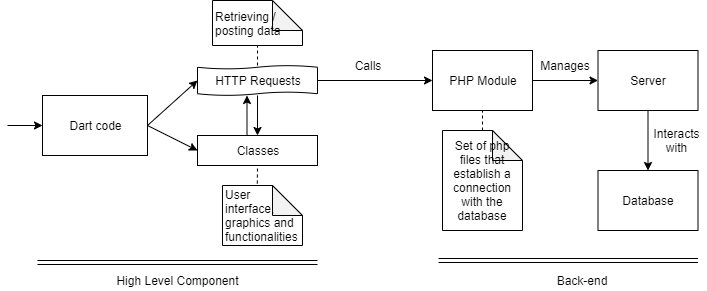

# openCX-'Sir Conference' Development Report

Welcome to the documentation pages of the Conference Manager of **openCX**!

You can find here detailed about the Conference Manager, hereby mentioned as module, from a high-level vision to low-level implementation decisions, a kind of Software Development Report, organized by discipline (as of RUP): 

* Business modeling 
  * [Product Vision](#Product-Vision)
  * [Elevator Pitch](#Elevator-Pitch)
* Requirements
  * [Use Case Diagram](#Use-case-diagram)
  * [User stories](#User-stories)
  * [Domain model](#Domain-model)
* Architecture and Design
  * [Physical architecture](#Physical-architecture)
  * [Logical architecture](#Logical-architecture)
  * [Prototype](#Prototype)
* [Implementation](#Implementation)
* [Test](#Test)
* [Configuration and change management](#Configuration-and-change-management)
* [Project management](#Project-management)

So far, contributions are exclusively made by the initial team, but we hope to open them to the community, in all areas and topics: requirements, technologies, development, experimentation, testing, etc.

Please contact us! 

Thank you!

* André Filipe da Silva Moutinho
* João Ricardo Ribeiro Cardoso
* Nuno Duarte Ferreira Neves Mourinha Gonçalves
* Sergio Bruno Rodrigues Dias

---

## Product Vision

Our vision is simple: we want to revolutionise the way conferences are carried out. Ultimately, we are aiming towards a new "conference style", in which participants play a significant role in deciding its path, by asking questions and thereby showing what topics they are most concerned about. In our view, conferences should no longer be about big talks and just hearing.

---
## Elevator Pitch

To answer the need to enrich the interations between the participants of a conference with each other and with the speakers of a lecture, we created the app *Conference Manager*. This app allows the participants to ask questions to the speaker through an app, making it so they don't shy away from asking the questions they want to. If multiple participants have the same question, they can hit the like button to give an higher priority to that question. These questions are shown in a screen using a raspberry pi that the speaker can see so they can answer the questions. This allows the speaker to answer these questions at the apropriate time without interupting their speech, making it so context changes don't undermine the flow of the speech.

---
## Requirements

Our module is an interation between speaker and listeners.

In this section, you should describe all kinds of requirements for your module: functional and non-functional requirements.

Start by contextualizing your module, describing the main concepts, terms, roles, scope and boundaries of the application domain addressed by the project.

### Use case diagram

### User stories

Our user stories can be seen in [this Trello page](https://trello.com/b/lqFjtiSm/user-stories)

### Domain model

---

## Architecture and Design

As far as the project's architecture is concerned, we could divide it into 3 parts, namely the high-level components, the back-end (server and database) and the components that establish a connection between the two. Below there is a diagram illustrating this schema.

As a side note, it's important to note that HTTP Requests is the part of dart code (set of files) that call the PHP Module and interacts with the high level layer, processing its requests.

The main code behind the application, i.e. everything related to the logical architecture, is responsible for processing the functionalities requested by the end user. However, in order to fulfill most requests, there's the need to call functions from another layer, where all the functions that interact with the database are built. For a better organization of the main code, we split it into two parts: the front-end and back-end. The first one consists of Classes, which will be better described in the next section.  

### Physical architecture

Out of the parts mentioned in the previous section, the latter is the most relevant one here, and that's where the functions related to the mentioned connection are defined. To be precise, it includes the following files:

 -> authentication.dart
 
 -> questionsDB.dart
 
 -> registration.dart
 
 -> sessionsManagement.dart

The name of these files is self-explanatory; for example, the first one includes the necessary code that falls under back-end layer to authenticate a user. On the other hand, the sessionManagement.dart file includes all the functions reponsible for creating/deleting sessions from the database. 

When it comes to the back-end itself, it consists of PHP files that receive requests from the dart code (specifically, the code related to the previously listed files) and forwards them to the database (MySQL), managed through the tool phpMyAdmin. All the used PHP files can be found in a separate folder (CLICK HERE). When it comes to the database, there is also a SQL file on this repository, which can be found in a separate folder as well. However, for an easy perspective of the how the database is built (this is, the interaction between classes and the list of attributes), please refer to the domain model diagram in the previous section.

In the previous section, it is possible to find a component diagram showing the physical structure of the system.

### Logical architecture

Turning to logical architecture, the structure of the so called "main code" will now be explained in detail. This is the part of our project that mostly determines the user experience, since it is responsible for both displaying the user interface and handling all the user requests (although most of them are redirected to other "layers").

This high level component encompasses a set of files, each of them related to one page of the application. By the way, there is a State Machine pattern associated with this part of the code, so we will analyze this component under that perspective.

Upon opening the application, the log in page is promptly shown to the user. In this state, there are a few ways to go besides just authenticating, including the option to sign up, log in as guest or even recover the password. If the user goes with sign up, a registration form will be presented, allowing the user to create an account. Else, if the "forgot your password" button is pressed, a different form is presented, allowing the user to change his password after answering a security question. For these two situations, the user is taken back to the Log In page after finishing the respective actions. If the selected button is "log in", assuming the user enters correct credentials, it is then redirected to the Sessions page. 

Once there, the logged username is displayed and there's a gear icon on the right side. When clicked, the user is taken to his profile page, from which the username and/or password can be changed. On the bottom of the Sessions page, there are 2 buttons; by clickcing them, a window is popped up, and depending on which one was clicked, the user is prompted to create or delete a session. Finally, there's a field where the user can type a session code and then join it. 

After joining the session, the user is taken to a screen where all the questions belonging to that talk are displayed. Regarding the possible actions when in this page, the user can submit a new question, like an existing one or delete questions if we're talking about the user who created the session (administrator). 

It's also important to notice the code behind the implementation of this pages mainly consists of overloading the build() method of a parent widget, which then integrates sub-widgets. Besides that, there are functions that implement the wished functionalities. These could be divided into the functions that are called upon triggering a button and auxiliary functions.

### Prototype

Here is a briefing of our progress at the end of iteration #0, including the used tecnologies and  implementation of user stories.
When it comes to the use of technology, we soon realized that Flutter would be our key tool in the development of our project, since it is focused on the creation of two applications (mobile + web). By the end of this iteration, the group members are capable of using the basics of Flutter, which was essential not only to complete the prototype but also for future development. Besides this, some of the group members also started setting up a back-end, which eventually led to the few following needs: learn how to use phpMyAdmin, learn some php knowledge, learn mysqli API and set up a server that runs on a website (web000host).

Speaking now of the progress made, we spent a considerable amount of time building the app pages (design part), since it is the base for the implementation of ever user story. However, we still managed to complete the user story "As a participant, I would like to ask questions". Given that most of the remaining stories required interaction with a server and database, which took us a huge amount of time to figure out, we couldn't finish any more by the end of propotype phase. Nevertheless, we have designed the core of the interface and navigation between pages is implemented.

In conclusion, we believe that the goals for this iteration were all achieved and we are on the right road to implement further features. 

---

## Test

We have tested the following features:

* Log in as guest

* Enter a specific session

* Ask a question

To implement those tests, we used acceptance tests with the help of the flutter_gherkin package for flutter.

The automated tests of this features can be seen [here](https://github.com/softeng-feup/open-cx-sirconference/tree/master/mobile_app/test_driver/steps).

---

## Configuration and change management

The members responsible for this project didn't find the need to use branches. Instead, we would always plan our tasks ahead of time and communicate among ourselves, thus knowing which changes were going to be performed. That said, the merge feature from GitHub was enough to manage our repository.

---

## Project management

We are using trello to manage our tasks. Use [this link](https://trello.com/b/tFAqYgMt/sirconference-project) to see what we are up to.

---

## Evolution - contributions to open-cx

In order to contribute to open-cx, we are providing our web application. Not only it is the most unique feature about your project (asking questions in a mobile and having them displayed on a bigger screen), but it's also a great addition for any app that aims for interaction between the speaker and the audience. We didn't manage to fully integrate it with the open-cx backend, but we commented the code to make it easily understandable and added a README.txt file in our pull request.

