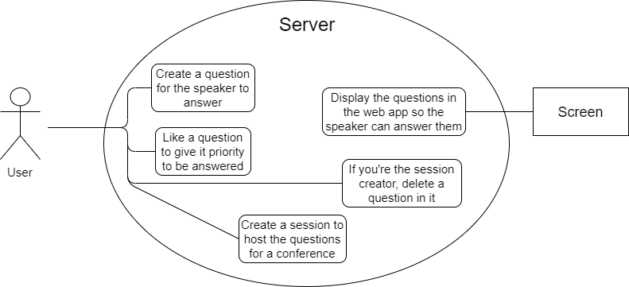

# openCX-*your module name* Development Report

Welcome to the documentation pages of the *your (sub)product name* of **openCX**!

You can find here detailed about the (sub)product, hereby mentioned as module, from a high-level vision to low-level implementation decisions, a kind of Software Development Report, organized by discipline (as of RUP): 

* Business modeling 
  * [Product Vision](#Product-Vision)
  * [Elevator Pitch](#Elevator-Pitch)
* Requirements
  * [Use Case Diagram](#Use-case-diagram)
  * [User stories](#User-stories)
  * [Domain model](#Domain-model)
* Architecture and Design
  * [Logical architecture](#Logical-architecture)
  * [Physical architecture](#Physical-architecture)
  * [Prototype](#Prototype)
* [Implementation](#Implementation)
* [Test](#Test)
* [Configuration and change management](#Configuration-and-change-management)
* [Project management](#Project-management)

So far, contributions are exclusively made by the initial team, but we hope to open them to the community, in all areas and topics: requirements, technologies, development, experimentation, testing, etc.

Please contact us! 

Thank you!

André Filipe da Silva Moutinho
João Ricardo Ribeiro Cardoso
Nuno Duarte Ferreira Neves Mourinha Gonçalves
Sergio Bruno Rodrigues Dias

---

## Product Vision

Our vision is simple: we want to revolutionise the way conferences are carried out. Ultimately, we are aiming towards a new "conference style", in which participants have a bigger role than ever. In our view, conferences should no longer be about big talks and just hearing.

---
## Elevator Pitch

To answer the need to enrich the interations between the participants of a conference with each other and with the speakers of a lecture, we created the app *Conference Manager*. This app allows the participants to ask questions to the speaker through an app, making it so they don't shy away from asking the questions they want to. If multiple participants have the same question, they can hit the like button to give an higher priority to that question. These questions are shown in a screen using a raspberry pi that the speaker can see so they can answer the questions. This allows the speaker to answer these questions at the apropriate time without interupting their speech, making it so context changes don't undermine the flow of the speech.

---
## Requirements

Our module is an interation between speaker, listeners and 

In this section, you should describe all kinds of requirements for your module: functional and non-functional requirements.

Start by contextualizing your module, describing the main concepts, terms, roles, scope and boundaries of the application domain addressed by the project.

### Use case diagram

### User stories

Our user stories can be seen in [this link](https://trello.com/b/lqFjtiSm/user-stories)

### Domain model

---

## Architecture and Design

As far as the project's architecture is concerned, we could divide it into 3 parts, namely the high-level components, the back-end (server and database) and the components that establish a connection between the two. Below there is a diagram illustrating this schema.

(DIAGRAMA AQUI)

The main code behind the application, i.e. everything related to the logical architecture, is responsible for processing the functionalities requested by the end user. However, in order to fulfill most requests, there's the need to call functions from another layer, where all the functions that interact with the database are built. For a better organization of the main code, we split it into two parts: the front-end and back-end. The first one consists of Classes, which will be better described in the next section. The latter is the most relevant one here, and that's where the functions related to the mentioned connection are defined. To be precise, it includes the following files:

 -> authentication.dart
 -> questionsDB.dart
 -> registration.dart
 -> sessionsManagement.dart

### Logical architecture

*Coming soon*

### Prototype

*Coming soon*

---

## Implementation

*Coming soon*
---
## Test

*Coming soon*

## Configuration and change management

*Coming soon*

---

## Project management

We are using trello to manage our tasks. Use [this link](https://trello.com/b/tFAqYgMt/sirconference-project) to see what we are up to.
